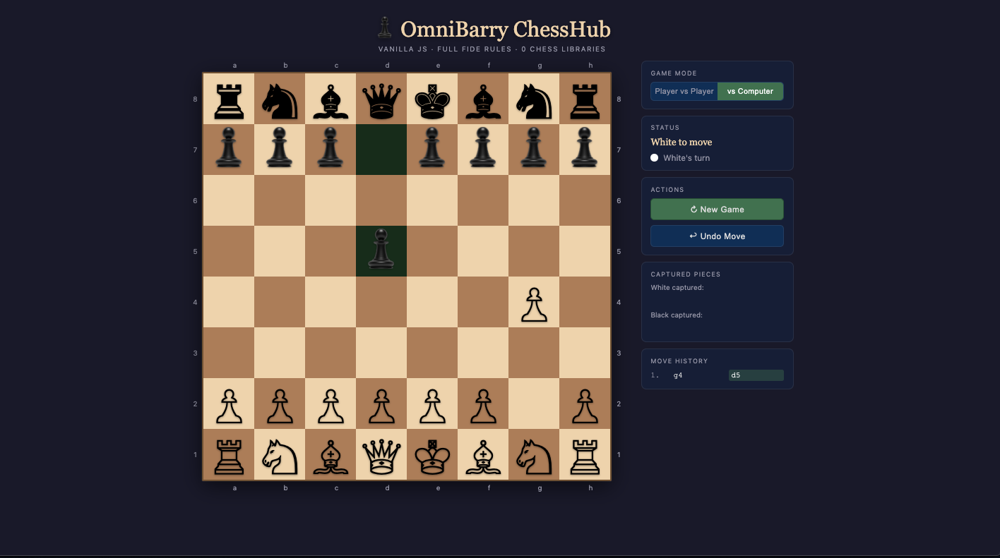

# ♟ OmniBarry ChessHub

A fully playable, zero-dependency chess engine built entirely in vanilla HTML, CSS, and JavaScript. No frameworks. No build step. No server. One file.

## Preview

---

## Features

### Game Rules — Full FIDE Compliance
- ✅ Legal move validation (king cannot move into or remain in check)
- ✅ Castling — kingside and queenside, with full path-safety enforcement
- ✅ En passant capture
- ✅ Pawn promotion with interactive piece-selection UI
- ✅ Check, checkmate, and stalemate detection

### Gameplay
- ♟ **Player vs Player** — local two-player mode on one device
- **Player vs Computer** — built-in AI opponent
- ↩ **Undo** — step back one move at any time (reverses both sides in AI mode)
- **New Game** — instant restart without page reload

### AI Engine
- Minimax algorithm with alpha-beta pruning (depth 3)
- Piece-square table positional evaluation
- Opening book with real responses (Sicilian, French, Caro-Kann, Queen's Pawn, Dutch, and more)
- Candidate pool sampling — AI draws from all equally-strong moves, not just the first found, producing genuine variation across repeated positions
- Move order shuffling for additional line diversity

### UI & Experience
- Legal move highlighting — dots for empty squares, rings for captures
- Last-move highlight on both origin and destination squares
- King square pulses red when in check
- Scrollable algebraic move history
- Captured pieces display with material advantage indicator
- "Computer thinking" animation while AI calculates
- Coordinate labels (a–h / 1–8) around the board

### Responsive Design
- Fully playable on every screen size from 280px (Galaxy Fold) to 4K displays
- Board-first layout — square size driven by viewport, nothing ever clips
- Landscape orientation handled separately for phones rotated sideways
- 44px minimum touch targets on all interactive elements (WCAG AA)
- Sidebar reflows below the board on mobile, beside it on tablet and desktop

---

## How It Works

### Architecture

The app is a single `pack.html` file with six internal sections:

| Section | Responsibility |
|---|---|
| HTML Markup | Board grid, coordinate labels, sidebar panels, promotion modal |
| CSS Styles | Board theme, highlights, responsive layout system |
| Game State | Board array, turn tracking, castling rights, en passant target |
| Move Generation | Per-piece pseudo-legal moves + check filtering = fully legal moves |
| AI Engine | Minimax + alpha-beta + PST evaluation + opening book |
| UI & Events | DOM rendering, click handling, history, captured pieces |

### AI — How the Computer Thinks

The engine runs a **minimax tree search** 3 levels deep. At each node it:

1. Generates all legal moves for the current side
2. Simulates each move on a cloned board
3. Recursively evaluates the opponent's best reply
4. Scores positions using **material value + piece-square table bonuses**
5. Uses **alpha-beta pruning** to discard branches that cannot improve the result

**Scoring weights:**

| Piece | Value |
|---|---|
| Pawn | 100 |
| Knight | 320 |
| Bishop | 330 |
| Rook | 500 |
| Queen | 900 |
| King | 20,000 |

Positional bonuses (piece-square tables) reward centralised knights, active bishops, connected rooks, advanced pawns, and penalise edge pieces and passive kings.

**Why the AI varies its replies:**
Rather than returning the single top-scoring move deterministically, the engine collects all moves within 30 centipawns of the best score and selects randomly from that pool. Combined with move-order shuffling and an opening book, this means the computer has genuine autonomy — undoing and replaying the same move will not always produce the same response.

---

## Running Locally

No build step. No dependencies.

That is the entire setup process.

---

---

## Browser Support

| Browser | Support |
|---|---|
| Chrome / Edge 90+ | ✅ Full |
| Firefox 88+ | ✅ Full |
| Safari 14+ | ✅ Full |
| Samsung Internet 14+ | ✅ Full |
| Opera 76+ | ✅ Full |

---

## Roadmap

- [ ] Difficulty levels (depth 1 / 3 / 5)
- [ ] Board theme switcher (classic, green, blue, midnight)
- [ ] Flip board (play as Black against AI)
- [ ] Move timer / clock mode
- [ ] PGN export of completed games
- [ ] Puzzle mode

---

## License

MIT — free to use, modify, and distribute. See [LICENSE](LICENSE) for details.

---

## Author

Built with precision and no shortcuts.  
If you find a bug or want to contribute, open an issue or pull request.
Andre Courage Aganmwonyi-Barry Osas---KING.
