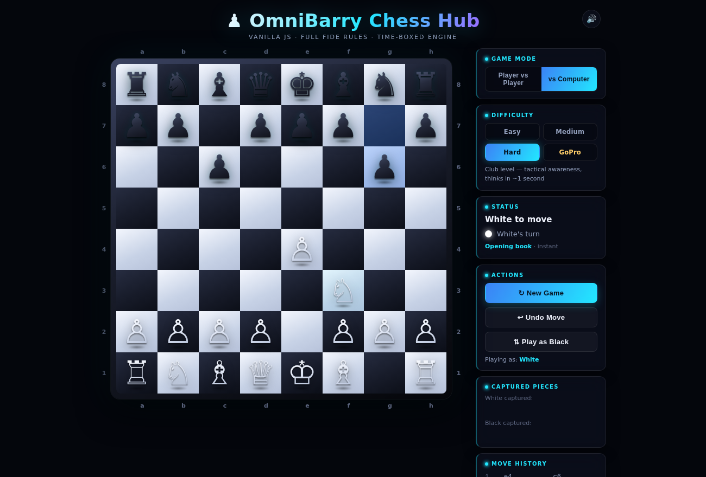

# ♟ OmniBarry ChessHub

> A fully playable chess engine — vanilla HTML, CSS, and JavaScript, with a
> native C/WASM search core baked in.
> No frameworks. No libraries. No server. One file to play.

## Preview

---

## What This Is

OmniBarry ChessHub is a complete, production-quality chess application built without a single runtime dependency. No Chess.js. No Stockfish. No jQuery. No React. Every rule, every pixel, and the AI's search algorithm — written from scratch, in one HTML file players actually open and run.

The UI is a dark, glass-and-glow "next-gen console" skin — animated ambient background, chrome/graphite board and pieces, FLIP-animated moves, synthesized sound effects, drag-to-move — built to look and feel like a premium game, not a demo.

It is built to be played by anyone from a first-time beginner to a competitive club player, with a difficulty system that scales from forgiving to formidable — and, as of this rebuild, **never makes you wait**: every difficulty is hard-capped to a human-scale thinking time (see [AI Performance](#ai-performance--why-it-used-to-hang) below).

---

## Features

### Full FIDE Rule Enforcement
- Legal move validation — king cannot move into or remain in check
- Castling — kingside and queenside, with full path-safety enforcement (king cannot pass through or land on an attacked square)
- En passant capture
- Pawn promotion with interactive piece-selection UI
- Check, checkmate, and stalemate detection

### Game Modes
- **Player vs Player** — local two-player on one device
- **vs Computer** — built-in AI opponent with four difficulty levels
- **Play as Black** — flip the board, AI opens as White

### Difficulty Levels
| Level | Behaviour | Thinking cap | Audience |
|---|---|---|---|
| **Easy** | Depth ≤2, deliberate mistakes, high blunder rate | ~0.35s | Beginners, children |
| **Medium** | Depth ≤3, occasional oversights, noise injection | ~0.6s | Casual players |
| **Hard** | Depth ≤4 + quiescence, tactical awareness | ~1.1s | Club players |
| **GoPro** | Depth ≤5 + full quiescence, maximum engine strength | ~2.2s | Serious challengers |

Every cap is a hard wall-clock budget, not a suggestion — see [AI Performance](#ai-performance--why-it-used-to-hang).

### AI Engine — How It Thinks

The engine runs a **minimax tree search** with **alpha-beta pruning**, extended by **quiescence search** on Hard and GoPro to prevent scoring positions mid-exchange. It's authored once in C (`engine-src/engine.c`), compiled to a ~29KB WASM binary, and embedded directly in `pack.html` for native-speed search inside a Web Worker; a hand-mirrored pure-JS engine in the same file is the automatic fallback if WASM ever fails to load. Both are cross-validated against known-correct [perft](https://www.chessprogramming.org/Perft_Results) values and an independently written reference move generator — see `engine-src/README.md`.

**Evaluation:**
- Material value (Pawn 100 → Queen 900 → King 20,000)
- Piece-square table positional bonuses (centralised knights, active bishops, advanced pawns, king safety)
- Personality bias — the AI draws one of three styles each game: aggressive, positional, or solid. Same strength, different character.

**Five layers of genuine variation** (why the AI never plays the same game twice):
1. **Opening book** — 20+ named openings (Sicilian, French, Caro-Kann, King's Indian, Dutch, Benoni, Alekhine, English, and more), chosen randomly per game
2. **Blunder injection** — Easy and Medium have a difficulty-scaled probability of ignoring the engine entirely, simulating human oversight
3. **Move order shuffle** — candidate list randomised before search; alpha-beta is order-sensitive, so equal lines surface differently each call
4. **Gaussian noise** — Easy and Medium add noise to move scores before pooling, so equivalent moves don't score identically
5. **Dynamic candidate pool** — all moves within a phase-scaled centipawn window of the best score are collected; one is chosen randomly. Opening phase: wider window. Endgame: tighter. The AI never deterministically locks onto a single move.

### UI & Experience
- Dark glass-and-glow "console" skin — animated ambient background, chrome/graphite board texture, gradient-metallic pieces with drop shadows
- Click **or** drag-and-drop to move
- FLIP-animated piece movement between squares, with a fading "capture" ghost on the taken piece
- Synthesized sound effects (move, capture, check, checkmate/stalemate) — no audio files, generated with the Web Audio API; muteable
- Legal move highlighting — glowing dots for empty squares, glowing rings for captures
- Last-move highlight on both origin and destination squares
- King square pulses red when in check
- Live engine HUD — search depth reached, time taken, evaluation, and whether the move came from the opening book, the native engine, or the JS fallback
- Scrollable algebraic move history (SAN notation)
- Captured pieces display with live material advantage indicator
- "Computer thinking" indicator with an animated scan bar during AI calculation
- Coordinate labels (a–h / 1–8), correct orientation on flip
- Pawn promotion modal with piece selection

### AI Performance — why it used to hang

Earlier versions could take **minutes** per move on higher difficulties. The
cause: move-legality checking cloned the entire board (with a fresh object
per piece) on every candidate move at every node of the search tree, there
was no move ordering (so alpha-beta pruning barely pruned anything), and —
critically — there was no time limit at all. Depth 4–5 with quiescence could
mean millions of full-board allocations with no upper bound on how long
that was allowed to take.

The rebuilt engine fixes all three at once:
- **In-place make/unmake search** — zero per-node allocation, mutate the board and undo it, instead of cloning
- **MVV-LVA move ordering** — captures and promotions searched first, so alpha-beta actually prunes
- **Hard time-boxed iterative deepening** — every difficulty has a wall-clock budget (0.35s–2.2s) checked deep inside the search; a search that runs out of time discards its unfinished depth and returns the best move from the last depth it *fully* completed, never a half-searched result
- **Runs in a Web Worker** — the AI thinks off the main thread, so the UI never freezes regardless of how long a move takes
- **Native C/WASM search core** — the same algorithm, compiled to WebAssembly, running at native speed inside that worker, with the pure-JS version as an automatic, transparent fallback

Net result: every difficulty, including GoPro (previously the worst offender), now replies in low single-digit seconds at most — matched to how long a person would actually think about a move, not minutes.

### Flip Board
Switch sides at any time in vs Computer mode. When playing as Black, the board renders from Black's perspective, coordinates reverse, and the AI opens as White automatically.

### How to Castle
Click your **king**. If castling is legal, a move dot will appear two squares toward the rook. Click it. The rook moves automatically. You never click the rook to castle.

Castling is unavailable if: the king or that rook has previously moved, any square between them is occupied, or the king is in check, passes through check, or would land in check.

### Responsive Design
- Playable on every screen from 280px (Galaxy Fold closed) to 4K
- Board-first layout — `--sq` CSS variable drives all sizing
- Landscape orientation handled with a dedicated breakpoint
- Minimum 44px touch targets on all interactive elements (WCAG AA)
- Sidebar reflows below board on mobile, beside it on tablet and desktop

---

## Architecture

Everything a player needs is `pack.html` — one file, nothing to install.

| Section | Responsibility |
|---|---|
| HTML Markup | Board grid, coordinate labels, sidebar, promotion modal |
| CSS Styles | Console-style theme, highlights, difficulty/flip UI, responsive layout |
| `#engine-core` (inert `<script type="text/plain">`) | Pure-JS chess engine — rules, move generation, and the time-boxed search — activated in the main thread via `eval` and shipped verbatim into the AI Worker as the fallback path |
| `#wasm-engine-core` (inert `<script type="text/plain">`) | The same search, authored in C and compiled to an embedded WASM binary, for native-speed search inside the Worker |
| Game State | Board array, turn, castling rights, en passant, flip state |
| AI Worker | Combines the two engine sources above; prefers WASM, transparently falls back to JS; keeps the AI's search fully off the UI thread |
| UI & Events | DOM rendering, click + drag handling, FLIP move animation, sound, history, captured pieces |

`engine-src/` holds the C source the WASM binary is built from, plus the
perft correctness suite used to validate it — see `engine-src/README.md`.
It's a build-time-only folder; nothing there is required to play.

---

## Running Locally

Download `pack.html`. Open it in any modern browser. That is the entire setup.

No build step. No `npm install`. No config. No server.

(`engine-src/` has its own build step — recompiling the WASM engine from C —
but that only matters if you're changing the AI's search itself. The
`pack.html` you download already has it baked in.)

---

## Browser Support

| Browser | Support |
|---|---|
| Chrome / Edge 90+ | ✅ Full |
| Firefox 88+ | ✅ Full |
| Safari 14+ | ✅ Full |
| Samsung Internet 14+ | ✅ Full |
| Opera 76+ | ✅ Full |

---

## Roadmap

- [ ] Board theme switcher (Classic, Green, Midnight, Blue)
- [ ] Move timer / clock mode (Blitz 5+0, Rapid 10+0)
- [ ] PGN export of completed games
- [ ] Puzzle mode — tactical positions for beginner skill-building
- [ ] Transposition table — deeper search within the same time budget via position memory
- [ ] Adaptive difficulty — AI adjusts to how you play mid-session
- [ ] Live spectator / share link for remote challenge mode

---

## License

MIT — free to use, modify, and distribute. See [LICENSE](LICENSE) for full terms.

---

## Author

**Andre Courage Aganmwonyi-Barry Osas**  
Built with precision. No shortcuts. No libraries.

> *"There are 1000 ways to win. The engine knows all of them."*
